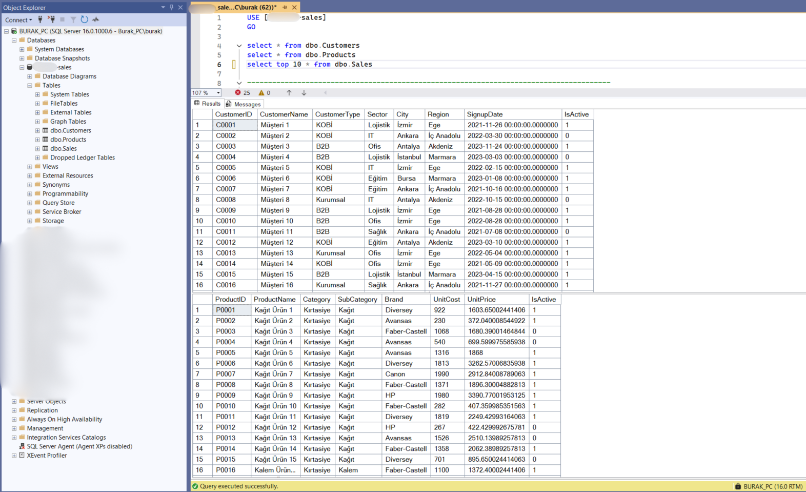
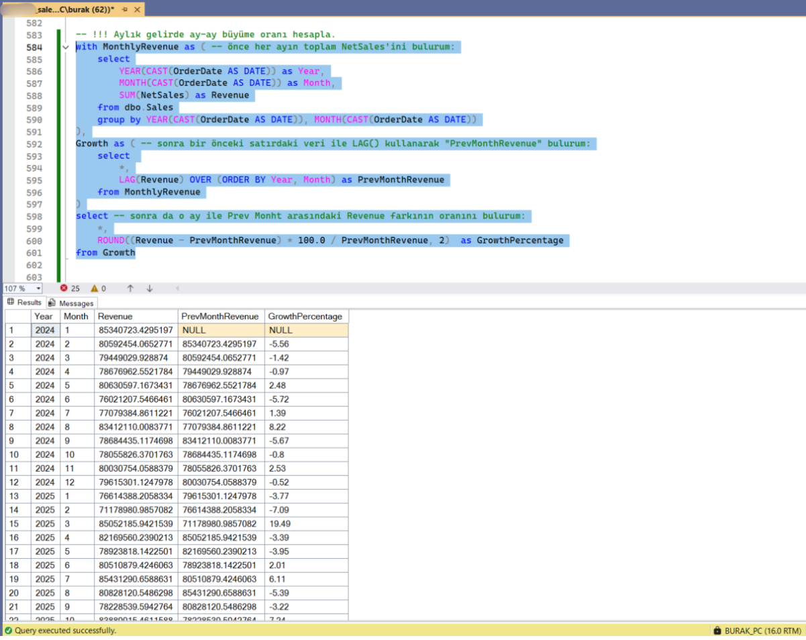

# 🗄️ SQL Customer Sales Analysis

Bu proje, **gerçek dünya iş senaryolarını taklit eden end-to-end bir SQL analiz çalışmasıdır**.  
Amacı, satış, müşteri ve ürün verilerini kullanarak farklı departmanların (Satış, Pazarlama, Müşteri İlişkileri, Data/BI) ihtiyaç duyduğu analizleri SQL ile gerçekleştirmektir.

Proje, **data analyst pozisyonlarında karşılaşılabilecek gerçek iş sorularına** odaklanarak, teknik SQL becerilerini ve **analitik düşünme yeteneğini** bir arada sergilemektedir.

---

## 🎯 Proje Hedefi

İşletmelerde farklı ekipler, kararlarını veri ile desteklemek için analytics ekibinden sıklıkla SQL sorguları talep ederler. Bu proje, aşağıdaki gerçek senaryoları simüle eder:

* **Satış Ekibi**: Günlük satış performansı, top ürünler, aylık trendler
* **Pazarlama Ekibi**: Kategori analizi, müşteri segmentasyonu, kampanya performansı
* **Müşteri İlişkileri**: Churn analizi, müşteri davranışları, tekrar satın alma oranları
* **Data/BI Ekibi**: İleri seviye window functions, outlier detection, cohort analysis

Her bir soru için:
- İş gereksinimi net şekilde tanımlanmıştır
- Analitik düşünce süreci yorum satırlarıyla açıklanmıştır
- Optimize edilmiş SQL sorguları geliştirilmiştir

---

## 📂 Dataset Açıklaması

Projede kullanılan veri seti, bir ofis malzemeleri şirketi senaryosuna dayanmaktadır ve 3 ana tablodan oluşmaktadır.

### **Sales Table** (50,000+ kayıt)
Satış işlemlerinin detaylı kayıtları:
- `SalesID`: Benzersiz satış kimliği
- `OrderDate`: Sipariş tarihi
- `CustomerID`: Müşteri kimliği (foreign key)
- `ProductID`: Ürün kimliği (foreign key)
- `Quantity`: Satış adedi
- `UnitPrice`: Birim fiyat
- `DiscountRate`: İndirim oranı
- `NetSales`: Net satış tutarı
- `OrderChannel`: Satış kanalı (Web, Mobile, Sales Rep)

### **Customers Table** (400+ müşteri)
Müşteri profil bilgileri:
- `CustomerID`: Benzersiz müşteri kimliği
- `CustomerName`: Müşteri adı
- `CustomerType`: Müşteri tipi (B2B, KOBİ, Kurumsal)
- `Sector`: Sektör (IT, Eğitim, Lojistik, Ofis, Sağlık)
- `City`: Şehir
- `Region`: Bölge
- `SignupDate`: Kayıt tarihi
- `IsActive`: Aktiflik durumu

### **Products Table** (150+ ürün)
Ürün kataloğu bilgileri:
- `ProductID`: Benzersiz ürün kimliği
- `ProductName`: Ürün adı
- `Category`: Ana kategori
- `SubCategory`: Alt kategori
- `Brand`: Marka
- `UnitCost`: Birim maliyet
- `UnitPrice`: Birim satış fiyatı
- `IsActive`: Katalog durumu


---

## 🧠 Kullanılan SQL Teknikleri & Metodolojiler

Bu proje, SQL yetkinliğini farklı seviyelerde göstermek üzere tasarlanmıştır:

### **Temel SQL Kavramları**
- `SELECT`, `WHERE`, `GROUP BY`, `HAVING`
- `JOIN` operations (INNER, LEFT, CROSS)
- Aggregate Functions (`SUM`, `AVG`, `COUNT`, `MAX`, `MIN`)
- Date Functions (`YEAR`, `MONTH`, `DATEADD`, `DATEDIFF`)

### **İleri Seviye Teknikler**
- **Common Table Expressions (CTEs)**: Karmaşık sorguların modüler hale getirilmesi
- **Window Functions**: 
  - `ROW_NUMBER()`: Sıralama ve ranking
  - `RANK()`, `DENSE_RANK()`: Performans sıralamaları
  - `LAG()`, `LEAD()`: Zaman serisi analizleri (MoM, YoY)
- **Subqueries**: İç içe sorgular ve filtreleme
- **CASE WHEN**: Müşteri segmentasyonu ve kategorizasyon
- **Statistical Functions**: `STDEV()` ile outlier detection

### **Gerçek İş Problemlerine Çözümler**
- **Cohort Analysis**: İlk alışveriş davranışı analizi
- **Churn Prediction**: Son 90 gün aktivite kontrolü
- **Customer Segmentation**: RFM benzeri segmentasyon mantığı
- **Trend Analysis**: Aylık bazda growth tracking
- **Performance Ranking**: Top N ürün/müşteri analizleri

---

## 📊 İş Senaryoları & Analiz Kategorileri

Projede toplam **60+ SQL sorgusu** 4 farklı departman perspektifinden hazırlanmıştır:

### 🔵 **Satış Ekibi (Sales Team)**
**Kolay Seviye:**
- Toplam ciro hesaplama
- Günlük/aylık satış trendleri
- Top 10 ürün analizi
- Dün yapılan satışlar

**Orta Seviye:**
- Aylık bazda satış karşılaştırmaları
- Müşteri başına ortalama harcama
- Kategori performans analizi
- İndirim etkisi analizi

**İleri Seviye:**
- Outlier detection (normalden yüksek satış günleri)
- Kanal bazlı performans (Web vs Mobile vs Sales Rep)
- Haftalık/aylık satış patternleri

### 🟢 **Pazarlama Ekibi (Marketing Team)**
**Kolay Seviye:**
- Kategori bazlı toplam satış
- En çok satan markalar
- Bölge bazlı satış dağılımı

**Orta Seviye:**
- Kategori bazlı müşteri başına gelir
- İndirimli satışların toplam içindeki payı
- Yeni müşteri kazanım trendleri (MoM)

**İleri Seviye:**
- Top 3 ürün analizi (her ay için window function ile)
- İlk alışverişte en çok tercih edilen ürünler
- Müşteri segmentasyonu (Low/Medium/High)

### 🟠 **Müşteri İlişkileri (Customer Success)**
**Kolay Seviye:**
- Aktif müşteri sayısı
- Şehir bazlı müşteri dağılımı
- En az satış yapan ürünler

**Orta Seviye:**
- Tekrar satın alma oranı
- İlk ve son alışveriş tutarı karşılaştırması
- Son 6 ayda müşteri sayısı artan şehirler

**İleri Seviye:**
- Churn riski analizi (90+ gün inaktif müşteriler)
- İlk alışverişten sonra tekrar alışveriş süresi
- En kârlı müşteri segmentleri

### 🔴 **Data/BI Ekibi (Advanced Analytics)**
**Challenge Seviye:**
- Her ay için top 3 ürün (window functions)
- Günlük satışlara göre outlier tespiti (statistical analysis)
- Aynı gün birden fazla sipariş veren müşteriler
- Zaman serisi analizleri (LAG/LEAD kullanımı)


---

## 🛠️ Kullanılan Araçlar & Teknolojiler

- **SQL Server (T-SQL)**
- **Database**: Microsoft SQL Server Management Studio (SSMS)
- **Version Control**: Git & GitHub
- **Data Analysis Concepts**: CTEs, Window Functions, Statistical Analysis

---

## 📁 Repository Yapısı

```
sql-customer-sales-analysis/
│
├── data/
│   ├── Customers.csv
│   ├── Products.csv
│   └── Sales.csv
│
├── sales_analysis_results/
│   └── sales_analysis.sql
│
├── images/
│   ├── 11
│   ├── 22
│   ├── 33
│   ├── 44
│   ├── 55
│   ├── 66
│   └── 77
│
└── README.md
```
---

## 📈 Örnek Analizler

### Örnek 1: Müşteri Segmentasyonu
```sql
-- Müşterileri harcama düzeyine göre segmentle (Low / Medium / High)
WITH CustomerRevenue AS (
    SELECT
        CustomerID,
        SUM(NetSales) AS CustomerTotalSpent
    FROM dbo.Sales
    GROUP BY CustomerID
)
SELECT
    *,
    CASE
        WHEN CustomerTotalSpent >= 6000000 THEN 'High'
        WHEN CustomerTotalSpent >= 4000000 THEN 'Medium'
        ELSE 'Low'
    END AS Segment
FROM CustomerRevenue
ORDER BY CustomerTotalSpent DESC
```

### Örnek 2: Aylık Yeni Müşteri Kazanımı (MoM)
```sql
WITH MonthlyNewCustomers AS (
    SELECT
        YEAR(SignupDate) AS Year,
        MONTH(SignupDate) AS Month,
        COUNT(*) AS NewCustomerCount
    FROM dbo.Customers
    GROUP BY YEAR(SignupDate), MONTH(SignupDate)
)
SELECT
    Year,
    Month,
    NewCustomerCount,
    LAG(NewCustomerCount) OVER (ORDER BY Year, Month) AS PrevMonthCount,
    NewCustomerCount - LAG(NewCustomerCount) OVER (ORDER BY Year, Month) AS MoM_Difference
FROM MonthlyNewCustomers
ORDER BY Year, Month
```

### Örnek 3: Şehir bazında müşteri başına düşen ortalama gelir
```sql
with CityRevenue as ( -- önce her şehirdeki toplam NetSales'i bulurum:
	select
		c.City,
		SUM(s.NetSales) as TotalRevenue
	from dbo.Sales s
	inner join dbo.Customers c
		on c.CustomerID = s.CustomerID
	group by c.City
),
CityCustomerCount as ( -- sonra her şehirdeki toplam müşteri sayısını bulurum:
	select 
		City,
		COUNT(DISTINCT CustomerID) as CustomerCount
	from dbo.Customers
	group by City
)
-- sonra da bu CTE'leri oranlarım:
select
	c1.City,
	c2.CustomerCount,
	c1.TotalRevenue,
	(c1.TotalRevenue * 1.0 / c2.CustomerCount)  as RevenuePerCustomer
from CityRevenue c1
inner join CityCustomerCount c2
	on c1.City = c2.City
```

### Örnek 4: İlk alışverişten sonra tekrar alışveriş yapma süresi analizi
```sql
with RankedOrders as (  -- her müşterinin tüm alışverilerini sıraya koyarım, sonra da row_num 1 ve 2 olanlar arasında geçen süreyi kontrol ederim:
	select
		CustomerID,
		OrderDate,
		ROW_NUMBER() OVER(PARTITION BY CustomerID ORDER BY OrderDate ASC) AS row_num
	from dbo.Sales
)
select
	r1.CustomerID,
	r1.OrderDate as FirstOrder,
	r2.OrderDate as SecondOrder,
	DATEDIFF(DAY, r1.OrderDate, r2.OrderDate) as DayBetween
from RankedOrders r1
inner join RankedOrders r2
	on r1.CustomerID = r2.CustomerID
where r1.row_num = 1 and r2.row_num = 2
```

---
## 📫 Contact & Portfolio

- **LinkedIn**: linkedin.com/in/burak-kaptan/
- **GitHub**: github.com/bkaptan
- **Portfolio Website**: burak-kaptan.super.site/

---

